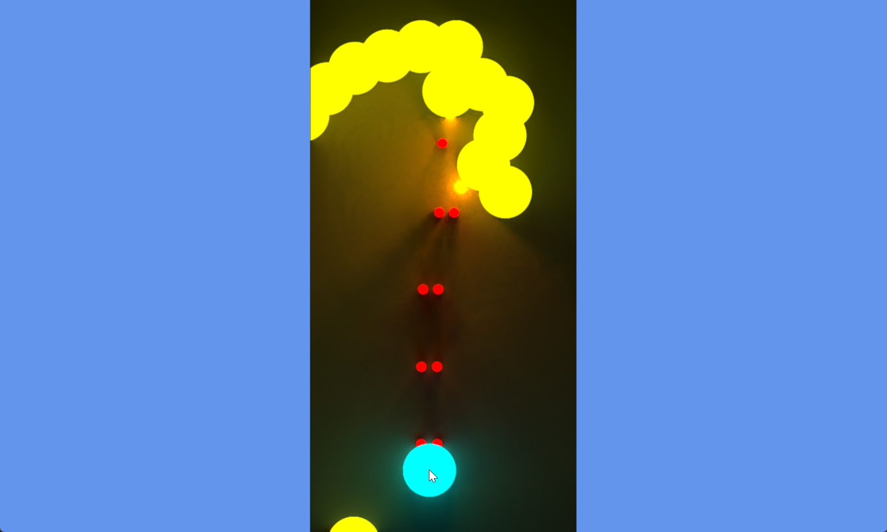
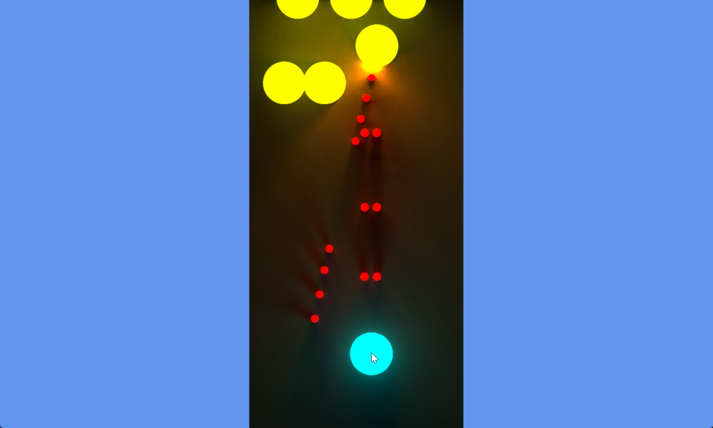

# simple_dod_game

## Description
The goal of this project is to experiment with data-oriented design (DOD) principles while building a small scroll shooter game. Here's what I learned during this journey.

Most applications deal with two main kinds of data:

- Configuration data — read-only at runtime (static settings, game balance values, enemy stats, etc.)
- Runtime data — mutable state that changes during gameplay (positions, velocities, health, etc.)

For this game, configuration (source) data is stored in `*.xlsx` files.  
For small datasets, Excel files are an excellent choice: they're easy to edit, review, and query.

To make loading fast and simple in the game, I chose a flat binary file format with these main requirements:

- Simple structure
- Flat memory load (no parsing needed at runtime)

To desctibe data layout for binary file format I used YAML files.

The export process works like this:

- Describe data layout for binary file in YAML files.
- Run small javascript programm **export_runtime_binary.js** that reads YAML file and data from XLSX file and produse binary file.
- Run small javascript programm **export_imhex_pattent.js** to generate imhex binary layout file for visual debuging problems with binary file.
- Run small javascript programm **export_c_header.js** to generate matching header file that know how to read this binary file.

Traditionally, people only use code (structs/classes) to describe runtime memory layouts.  
In this experiment, I decided to treat runtime data the same way as configuration (source) data.

I created YAML layout descriptions for runtime structures too.  
Using the same scripts, I generated:

- Empty binary files (filled with zeros) matching the runtime layout
- Corresponding C files for reading/writing those structures
- imhex layout file for debugging

This gives a single path and some format for both config(source) and runtime data.

This approach greatly increases code reuse and — I hope — significantly reduces the number of bugs in the codebase.
By defining both runtime and configuration (source) data in the same format and making them obey the same rules, we can build powerful shared abstractions.

One concrete example is the query system. I called it "maps", described directly in the YAML files.

This system allows selecting subsets of data.  
It enables writing generic, reusable code that operates on any matching data slice — whether it's config data, runtime entities without duplicating logic.

To make a simple scroll shooter more visually interesting, I implemented a 2D version of the Radiance Cascade algorithm for real-time global illumination.
This adds soft bounced lighting and ambient occlusion-like effects — making even basic shapes feel much more alive.

## Screenshots

## Build And Run Instructions

Dependencies:

* Node.js
* MSVC (Visual Studio Build Tools)

To ensure a clean setup, I recommend configuring dependencies to work only within the current shell (see the example in shell.bat). 
After setting up the dependency paths, run build.bat to create the executables and generate all necessary files.

To run the application, use:

* run_dm.bat for the debug build
* run_rm.bat for the release build

The game uses DirectX 11 for rendering.

In debug builds, the game uses the DirectX Debug Layer.
For the debug layer to work, it is necessary to install Graphics Tools from the Optional Features section in Windows Settings.
